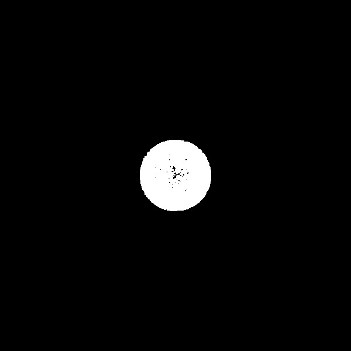
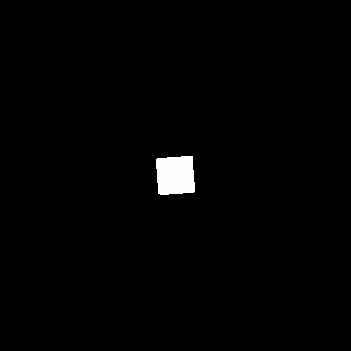
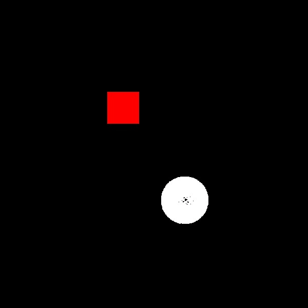

## Hyperelastic Material
Result[[Chenfanfu Jiang 2016]](#Reference):

## Elasto-plastic Materials

Result[[Alexey Stomakhin 2013]](#Reference):

## APIC vs. PIC
APIC not only stably removes the dissipation of PIC, but also allows for **exact conservation of angular momentum** across the transfers between particles and grid[[Chenfanfu Jiang 2015]](#Reference).

**PIC**:

**APIC(Only P2G & G2P)**:
Due to errors inherent in the time integration and the lack of physical constraints, the particle volume keeps increasing over time.

**APIC**:

## Coupling

**PIC**:

**APIC**:

## Debugging Tips
- MPM and FEM are just different discretization methods, and both must satisfy the CFL condition. Therefore, when using explicit time integration, the time step must be sufficiently small (¦¤t < 1e-4).
- The mass and volume of each material point should be estimated based on the number of grid divisions, following real-world settings for density, Young's modulus, and Poisson's ratio.

## Reference
[1] [Chenfanfu Jiang et al., *The Material Point Method for Simulating Continuum Materials*, 2016](https://www.math.ucla.edu/~cffjiang/research/mpmcourse/mpmcourse.pdf)

[2] [Alexey Stomakhin et al., *A Material Point Method For Snow Simulation*, 2013](https://disneyanimation.com/publications/a-material-point-method-for-snow-simulation/)

[3] [Chenfanfu Jiang et al., *The Affine Particle-In-Cell Method*, 2015](https://www.math.ucla.edu/~cffjiang/research/apic/paper.pdf)

